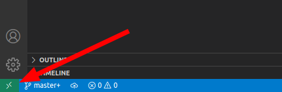

# Big Data hands-on - Kappa Architecture - Solution

## Getting started

> *Note: Please follow the [installation docs](https://github.com/IBCNServices/lab-kappa-docs) for the Kappa course first.*

1. Clone this repository to your computer using git.
1. Open `lab-kappa.code-workspace` using Visual Studio Code.
1. Choose "Yes, I trust the authors", so VSCode enables regular mode.

   

1. Click on the "Remote" icon on the bottom left of VSCode.

   

   1. Choose the option "Reopen in container" from the command palette.

      

   1. The container will be automatically created based on the configuration included in the lab files.
1. Wait until the container is set up. This can take a few minutes because the container needs to be pulled and built. You can check the progress by clicking "Starting Dev Container (show log)" in the notification on the bottom right of VSCode.
1. When the containers are setup, open `introduction.ipynb` and follow the instructions there. When asked about which kernel to use, always choose the Python kernel `base (Python 3.9.7) /opt/conda/bin/python`.

## Appendix

### Reset environment and remove databases

If you encounter uncommon issues with Spark or connectivity issues to Kafka, it might help to remove all containers from your system, restart vscode and choose "open folder in container" again.

For users on Linux and macOS, run the following command in order to remove ALL containers from your system.

```shell
docker stop $(docker ps -aq) && docker rm $(docker ps -aq)
```

Windows users can do this from the Docker GUI or run the following commands in PowerShell:


```powershell
docker stop $(docker ps -aq)
docker rm $(docker ps -aq)
```

## Copyright

<a rel="license" href="http://creativecommons.org/licenses/by/4.0/"></a><br />This work is licensed under a <a rel="license" href="http://creativecommons.org/licenses/by/4.0/">Creative Commons Attribution 4.0 International License</a>.

Copyright © teaching staff of the Big Data hands-on course at UGent Academie voor Ingenieurs (UGain) at the Faculty of Engineering and Architecture - Ghent University.
